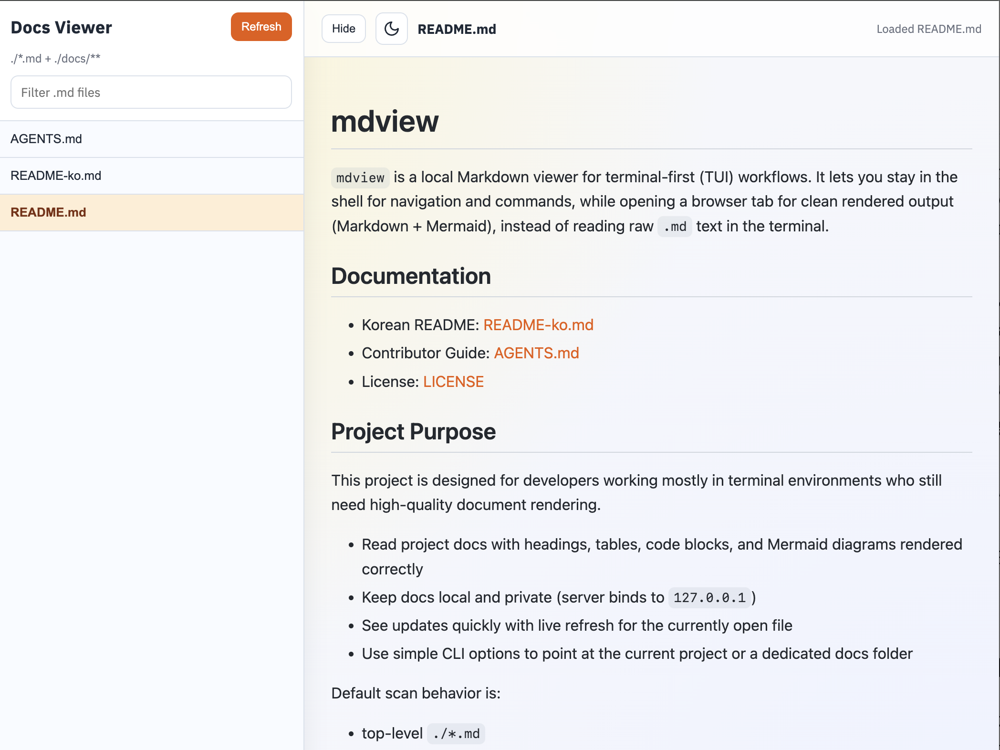
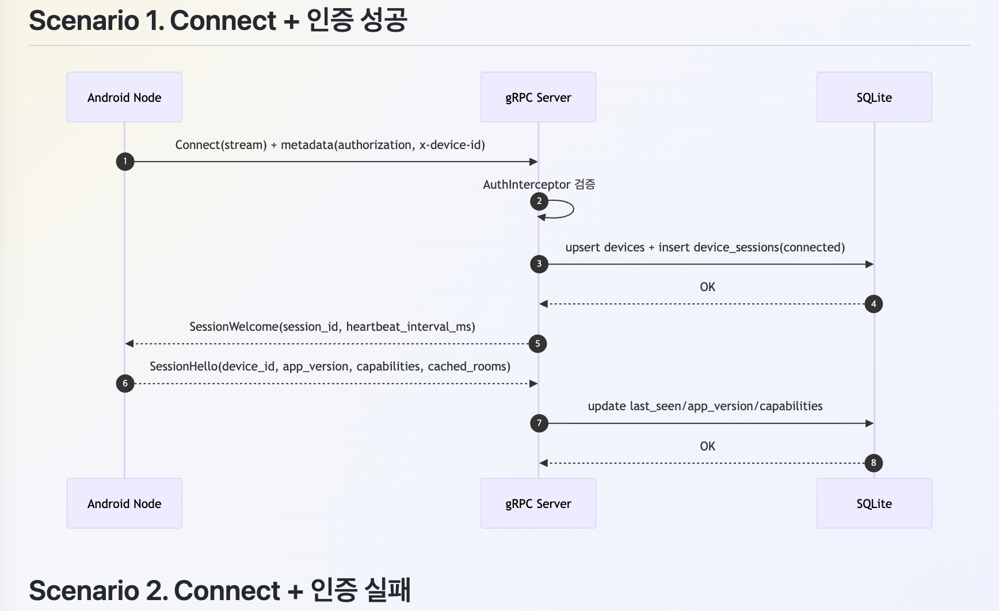

*Read this in other languages: [한국어](README-ko.md)*

# mdview

`mdview` is a local Markdown viewer for terminal-first (TUI) workflows.
It lets you stay in the shell for navigation and commands, while opening a browser tab for clean rendered output (Markdown + Mermaid), instead of reading raw `.md` text in the terminal.

## Screenshots
### Main Viewer


### Mermaid Rendering


## Documentation
- Contributor Guide: [AGENTS.md](./AGENTS.md)
- License: [LICENSE](./LICENSE)

## Project Purpose
This project is designed for developers working mostly in terminal environments who still need high-quality document rendering.

- Read project docs with headings, tables, code blocks, and Mermaid diagrams rendered correctly
- Keep docs local and private (server binds to `127.0.0.1`)
- See updates quickly with live refresh for the currently open file
- Use simple CLI options to point at the current project or a dedicated docs folder

Default scan behavior is:
- top-level `./*.md`
- recursive `./docs/**`

## Key Features
- Local HTTP viewer with file list and content preview
- Optional custom scan root via `--root`
- Live reload using SSE + file watching
- Foreground/background execution modes
- Single executable build with `bun build --compile`

## Requirements
- [Bun](https://bun.sh/) 1.x+

## Development Run
```bash
bun start
```
Open `http://127.0.0.1:18094`.

Useful options:
```bash
bun src/server.js --port 18081
bun src/server.js --root ./docs
bun src/server.js --foreground
```

## Build
```bash
bun run build
```
Build output:
- macOS/Linux: `dist/mdview`
- Windows: `dist/mdview.exe`

## Install

### macOS / Linux

1. Build and copy to your preferred location:
```bash
bun run build
mkdir -p "$HOME/bin"
cp dist/mdview "$HOME/bin/mdview"
```

On macOS you can also use the shortcut:
```bash
bun run deploy
```

2. Add the install directory to PATH (one-time setup):

**zsh** (default on macOS):
```bash
echo 'export PATH="$HOME/bin:$PATH"' >> ~/.zshrc
source ~/.zshrc
```

**bash**:
```bash
echo 'export PATH="$HOME/bin:$PATH"' >> ~/.bashrc
source ~/.bashrc
```

3. Verify:
```bash
which mdview
mdview --help
```

### Windows

1. Build:
```powershell
bun run build
```

2. Copy `dist\mdview.exe` to your preferred location, for example `C:\Users\<you>\bin\`:
```powershell
mkdir "$env:USERPROFILE\bin" -Force
copy dist\mdview.exe "$env:USERPROFILE\bin\mdview.exe"
```

3. Add the install directory to PATH:

**PowerShell** (permanent, user-level):
```powershell
$binPath = "$env:USERPROFILE\bin"
$currentPath = [Environment]::GetEnvironmentVariable("Path", "User")
if ($currentPath -notlike "*$binPath*") {
    [Environment]::SetEnvironmentVariable("Path", "$binPath;$currentPath", "User")
}
```
Restart the terminal for the change to take effect.

**CMD** (permanent, user-level):
```cmd
setx PATH "%USERPROFILE%\bin;%PATH%"
```
Restart the terminal for the change to take effect.

4. Verify:
```powershell
where.exe mdview
mdview --help
```

## Typical Usage
```bash
# From any project directory
mdview

# Use a specific docs root and port
mdview --root ./docs --port 18094
```

## Project Structure
- `src/`: server, file indexing, path guard, watcher, UI assets
- `scripts/`: build script (`bun build --compile` packaging)
- `vendor/`: bundled third-party browser assets
- `dist/`: generated build artifacts
